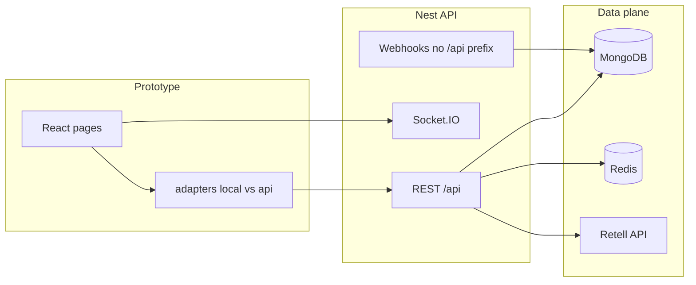

# Clinic CRM — Full stack & status summary

Single reference for **backend (NestJS)**, **frontend (Vite/React prototype)**, what is implemented, what stays local-only, and what remains for production hardening.

_Last updated: 2026-03-24_

---

## 1. Architecture at a glance

| Layer | Stack | Entry / notes |
|--------|--------|----------------|
| API | NestJS (`apps/backend`) | Global prefix `/api` except `health`, `metrics`, `webhooks/stripe`, `webhooks/retell`, `webhooks/calcom` |
| DB | MongoDB (Mongoose) | `MONGODB_URI` |
| Cache / queues | Redis + BullMQ | `REDIS_URL`; webhook/email/notification queues (feature flags in env) |
| Voice / AI | Retell SDK | `RETELL_API_KEY`; optional at startup in some configs |
| Realtime | Socket.IO (`/notifications` namespace) | JWT on connect; CORS aligned with HTTP |
| UI | React + Vite (`apps/prototype`) | `VITE_DATA_MODE=local \| api`, `VITE_API_URL` |

---

## 2. Backend (`apps/backend`)

### 2.1 Core modules (representative)

| Area | Path pattern | Role |
|------|----------------|------|
| Auth | `/api/auth/*` | Login, refresh, me, password, delete account |
| Tenants (admin) | `/api/admin/tenants/*` | CRUD, suspend, invite |
| Agents | `/api/admin/agents/*`, `/api/tenant/agents/*` | Instances, deploy, analytics, chats |
| Calls | `/api/tenant/calls/*`, `/api/admin/calls/*` | List, web-call, analytics, by Retell id |
| Bookings | `/api/tenant/bookings/*` | CRUD |
| Customers | `/api/tenant/customers/*` | CRUD, export, soft delete |
| Dashboard | `/api/tenant/dashboard/*` | Metrics, funnel, ROI, recent calls |
| Reports | `/api/tenant/reports/*`, `/api/admin/reports/*` | Performance, sentiment, peaks |
| Notifications | `/api/notifications/*` | List, read, unread count |
| Webhooks | `/webhooks/retell`, `/webhooks/stripe`, `/webhooks/calcom` | Raw body for HMAC; **no** `/api` prefix |
| Admin | `/api/admin/*` | Overview, system, billing, settings, audit, export |
| Health | `/health` | Mongo + Redis + Retell probe |
| Maintenance | `/maintenance/status`, `/api/admin/maintenance` | Status banner |

### 2.2 Retell & agent deployment

- **Client:** `src/retell/retell.client.ts` — agents, chat agents, `createWebCall`, errors surfaced.
- **Deployment:** `src/agent-deployments/` — voice vs non-voice create/delete alignment; rollback uses `deleteAgent` vs `deleteChatAgent` consistently.
- **Calls:** `CallsService.createWebCall` uses deployed `retellAgentId` + metadata (`tenant_id`, `agent_instance_id`).

### 2.3 Webhooks & idempotency

- **Service:** `src/webhooks/webhooks.service.ts` — dedupe, Retell status ordering (no downgrade), call session upserts.
- **Admin observability:** `GET /api/admin/webhooks/processed-events` — ledger of processed events.
- **Cal.com:** Controller registered under `WebhooksModule`; `CALCOM_WEBHOOK_SECRET` for HMAC.

### 2.4 Tenant settings (persisted extras)

Embedded under tenant `settings`: `featureFlags`, `locations`, `appointmentReminders`, `abTest`, `pms`, `providerAvailability` (see `src/tenants/schemas/tenant.schema.ts`, `src/settings/`).

### 2.5 Security & ops (high level)

- JWT + guards (`JwtAuthGuard`, `TenantGuard`, `AdminGuard`, permissions where used).
- CORS: `ALLOWED_ORIGINS` / `CORS_ORIGIN`; **default dev** includes `http://localhost:5173` and `http://localhost:3002` (`src/main.ts`).
- Helmet, throttling (where configured), webhook signature checks when secrets set.
- **Do not** commit secrets; use `.env` / secret manager.

### 2.6 NPM scripts (not exhaustive)

| Script | Purpose |
|--------|---------|
| `npm run start:dev` | Dev API |
| `npm run build` / `start:prod` | Production build/run |
| `npm run seed` | Seed DB |
| `npm run test` / `test:e2e` | Unit + minimal e2e |
| `npm run validate:infra` | Env + `GET /health` precheck |
| `npm run validate:infra:smoke` | Optional API smoke (needs `SMOKE_*` env) |

### 2.7 Backend “done” vs “remaining”

**Done (in code):** Modular Nest structure, Retell integration paths, webhook routing aligned with `main.ts`, health checks, processed-events admin route, tenant settings extensions, CORS defaults for common dev ports, e2e harness exclude list aligned with webhooks.

**Remaining / ops:** Full live smoke with real Retell + public URL; production `ALLOWED_ORIGINS`; non-empty webhook secrets where strict verification is required; monitoring and load testing as needed.

---

## 3. Frontend (`apps/prototype`)

### 3.1 Data mode

- **`VITE_DATA_MODE=local`** (default in `.env.example`): local adapters + seed/mock behavior.
- **`VITE_DATA_MODE=api`**: use HTTP adapters; **requires** running API at `VITE_API_URL` (default `http://localhost:3001/api`).

### 3.2 API client

- **`src/lib/apiClient.ts`** — `BASE_URL` from `VITE_API_URL`, bearer token, refresh, errors; no artificial cooldown blocking retries after backend starts.

### 3.3 Adapter matrix (`src/adapters/index.ts`)

When **`VITE_DATA_MODE=api`**, these use **API** implementations:

- dashboard, calls, analytics, bookings, customers, alerts, billing, staff, support, reports, admin, tenants, agents, settings, notifications, runs, export, audit, search, feature flags, webhooks, ab test, two factor (stub / honest UI), locations, pms, staff profile, soft delete (API semantics), gdpr, maintenance.

**Still local-only (not switched by mode):**

- **`toolsAdapter`**, **`skillsAdapter`** — prototype tooling; no tenant API wiring in index.

**Session / caches (API mode):**

- `primeTenantSettingsCaches` — hydrates feature flags, locations, ab/pms, provider availability from `GET /tenant/settings` (see `src/adapters/api/tenantSettingsCache.ts`).

### 3.4 Dev server

- **Default port:** `3002` (`vite.config.ts` / `VITE_PORT`).
- **CORS:** Backend must allow origin `http://localhost:3002` (included in default dev origins on API).

### 3.5 Frontend “done” vs “remaining”

**Done:** API adapters for core CRM flows; webhook log via admin API; settings-driven flags/locations; GDPR via API when in api mode; 2FA UI honest when API does not enforce TOTP; infra error messaging.

**Remaining:** Browser E2E (e.g. Playwright) if desired; wire tools/skills if those features go live; server-side MFA if product requires it.

---

## 4. Environment quick reference

### Backend (`apps/backend/.env` — not committed)

| Variable | Role |
|----------|------|
| `MONGODB_URI` | Required |
| `JWT_SECRET` | Required |
| `REDIS_URL` | Queues / health |
| `RETELL_API_KEY` | Retell API |
| `RETELL_WEBHOOK_SECRET` | Retell webhook verification |
| `STRIPE_*`, `CALCOM_WEBHOOK_SECRET` | Billing / Cal.com webhooks |
| `ALLOWED_ORIGINS` / `CORS_ORIGIN` | Production origins |
| `API_BASE_URL` / `SMOKE_BASE_URL` | Used by validation scripts |

See **`apps/backend/.env.example`**.

### Prototype (`apps/prototype/.env`)

| Variable | Role |
|----------|------|
| `VITE_DATA_MODE` | `local` \| `api` |
| `VITE_API_URL` | e.g. `http://localhost:3001/api` |

See **`apps/prototype/.env.example`**.

---

## 5. Local development (minimal)

1. **MongoDB + Redis** running (or relax queue usage per your setup).
2. **Backend:** `cd apps/backend && npm run start:dev` → listen on `3001` (or `PORT`).
3. **Frontend:** `cd apps/prototype && npm run dev` → often `http://localhost:3002`.
4. Set **`VITE_DATA_MODE=api`** and **`VITE_API_URL=http://localhost:3001/api`** for real API.

---

## 6. Related reports in this repo

| Document | Focus |
|----------|--------|
| `cursor/reports/real-infra-validation-run.md` | Automated vs manual real-infra proof |
| Other files under `cursor/reports/` | Historical audits, phases, Retell plans |

---

## 7. Summary table

| Topic | Status |
|-------|--------|
| Nest API + Mongo + Redis + Retell wiring | Implemented; verify with live smoke |
| Webhooks (Retell / Stripe / Cal.com) | Routes + raw body; secrets for strict verify |
| Prototype API mode | Broad adapter coverage |
| Tools/skills UI adapters | Local-only |
| Full production sign-off | Requires your staging/live run + evidence |

This file is the **overview**; detailed audits remain in the other `cursor/reports/*` documents where referenced.
