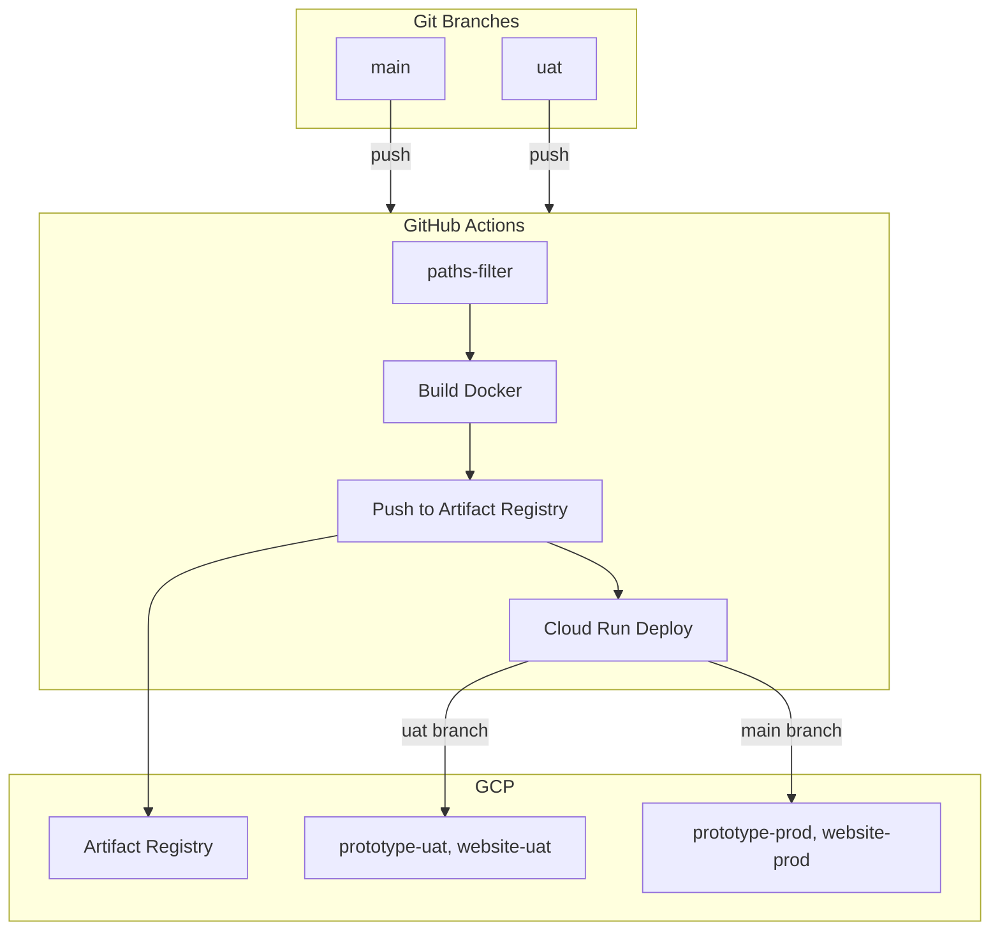

# Musaed Deployment Guide

This document describes the deployment architecture, GCP setup, and GitHub pipeline for the Musaed monorepo. Use it for onboarding and future reference.

---

## Overview

- **Monorepo**: Apps live under `apps/` (prototype, website, and future frontend, backend).
- **Local development**: Run apps directly with `pnpm dev`; no Docker required.
- **Cloud deployment**: Docker images are built only in CI and deployed to Google Cloud Run.
- **Environments**: UAT (from `uat` branch) and Prod (from `main` branch).

---

## Architecture



---

## Branch to Environment Mapping

| Branch | Environment | Cloud Run Services |
|--------|-------------|--------------------|
| `uat`  | UAT         | `musaed-prototype-uat`, `musaed-website-uat` |
| `main` | Prod        | `musaed-prototype-prod`, `musaed-website-prod` |

Only pushes to `uat` and `main` trigger deployment. Feature branches do not deploy.

---

## Change Detection

The pipeline deploys **only apps whose code changed**:

- **prototype**: Changes in `apps/prototype/**`, `pnpm-lock.yaml`, `package.json`, `pnpm-workspace.yaml`
- **website**: Changes in `apps/website/**`, `pnpm-lock.yaml`, `package.json`, `pnpm-workspace.yaml`

If neither app has changes, no deployment runs.

---

## Deploy to UAT Manually

Run the deploy script (requires `gcloud auth login` with kashif@metaklouds.com first):

```bash
# Re-authenticate if needed
gcloud auth login

# Deploy both apps to UAT
./scripts/deploy-uat.sh
```

The script creates the project, enables APIs, builds Docker images, and deploys to Cloud Run.

---

## GCP Prerequisites (Manual Setup)

Before the GitHub pipeline can deploy, you must:

1. **Create the project**
   ```bash
   gcloud projects create musaed --name="Musaed"
   ```

2. **Link billing** (required for Cloud Run)
   - Console: Billing > Link a billing account to musaed
   - Or: `gcloud billing accounts link <BILLING_ACCOUNT_ID> --project=musaed`

3. **Enable required APIs**
   ```bash
   gcloud services enable artifactregistry.googleapis.com run.googleapis.com secretmanager.googleapis.com --project=musaed
   ```

4. **Create Artifact Registry repository**
   ```bash
   gcloud artifacts repositories create musaed --repository-format=docker --location=us-central1 --project=musaed
   ```

5. **Create a service account for GitHub**
   - Create a service account with roles: `Artifact Registry Writer`, `Cloud Run Admin`, `Service Account User`.
   - Create a JSON key and store it as a GitHub secret (see below).

---

## GitHub Repository Secrets

Configure these in **Settings > Secrets and variables > Actions**:

| Secret | Description |
|--------|-------------|
| `GCP_PROJECT_ID` | GCP project ID (e.g. `musaed`) |
| `GCP_SA_KEY` | JSON key of the service account (entire JSON as string) |

For Workload Identity instead of a key, use `google-github-actions/auth` with `workload_identity_provider` and `service_account` in the workflow.

---

## Image Naming Convention

Images are pushed to Artifact Registry with this pattern:

```
us-central1-docker.pkg.dev/<PROJECT_ID>/musaed/<APP>:<ENV>-<GIT_SHA>
```

Examples:

- `us-central1-docker.pkg.dev/musaed/musaed/prototype:uat-abc1234`
- `us-central1-docker.pkg.dev/musaed/musaed/website:prod-def5678`

---

## Environment Variables

### Local Development

- Use `.env.local` (gitignored) or `.env` for each app.
- See `apps/prototype/.env.example` and `apps/website/.env.example` for reference.
- Load with `dotenv` or the framework’s built-in loader (Vite, Next.js).

### Cloud Run (UAT / Prod)

- **Non-sensitive**: Set in Cloud Run service configuration (different per environment).
- **Sensitive**: Store in Secret Manager, then reference in Cloud Run (e.g. `projects/musaed/secrets/API_KEY/versions/latest`).
- Use separate secrets per environment where needed (e.g. `*-uat-*`, `*-prod-*`).

---

## Dockerfiles (CI Only)

Dockerfiles are used **only in the GitHub pipeline** for building and deploying to Cloud Run. You do not run Docker locally unless you want to test production builds.

| App       | Stack       | Final Image                    |
|-----------|-------------|--------------------------------|
| prototype | Vite + React | nginx serving static `dist/`   |
| website   | Next.js     | Node running standalone server |

Both Dockerfiles expect the **repository root** as build context (e.g. `docker build -f apps/prototype/Dockerfile .`).

---

## Local Development Commands

```bash
# Install dependencies (from repo root)
pnpm install

# Run prototype
pnpm dev:prototype
# or: pnpm -F @musaed/prototype dev

# Run website
pnpm dev:website
# or: pnpm -F @musaed/website dev

# Build all apps
pnpm build
```

---

## Adding a New App

1. Create `apps/<name>/` with its own `package.json` (e.g. `"name": "@musaed/<name>"`).
2. Add a `Dockerfile` and `.dockerignore` in `apps/<name>/`.
3. Update `.github/workflows/deploy.yml`:
   - Add a filter in `paths-filter` for the new app.
   - Add a `deploy-<name>` job similar to `deploy-prototype` and `deploy-website`.
4. Add an `.env.example` in `apps/<name>/`.

---

## Troubleshooting

- **Build fails in CI**: Ensure `pnpm-lock.yaml` is committed and `pnpm install --frozen-lockfile` succeeds locally.
- **Cloud Run 502**: Check that the app listens on `PORT` (Cloud Run sets it; we use 8080 for nginx and Next.js).
- **Image push denied**: Verify `GCP_SA_KEY` has Artifact Registry permissions and the repository exists.
- **No deployment runs**: Confirm you pushed to `main` or `uat` and that the changed files match the path filters.
