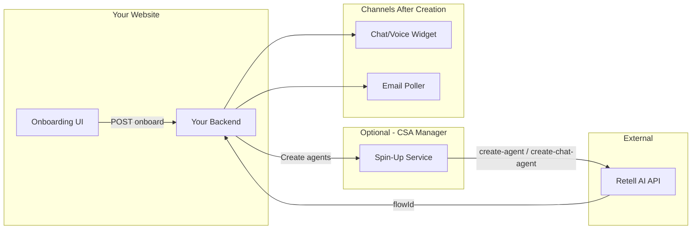

# CSA + Retell Integration Guide for External Websites

A complete, standalone guide for integrating the CSA agent creation and Retell flow into any website. Use this to understand the system and replicate it on your own platform.

---

## What This Flow Does

1. User creates a CSA agent via an onboarding form on your website
2. Your backend creates the agent record and triggers Retell agent creation
3. Retell creates one agent per channel (chat, email, voice)
4. Users embed a widget on their site to enable chat or voice
5. Email channel: your system polls inboxes and routes messages through Retell

---

## High-Level Architecture



---

## Prerequisites

| Item | Description |
| ---- | ----------- |
| Retell account | Sign up at retellai.com, get API key |
| Database | MongoDB or any DB to store agents, credentials, widget configs |
| Backend | Any backend (Node, Python, etc.) that can call Retell API |
| Flow template | JSON definition of conversation flow (nodes, tools, response engine) |

---

## Integration Paths

### Path A: Minimal (Chat Only)

Best for: Simple chat widget on a single website.

**Components:**

- Form to collect agent name and basic config
- Backend endpoint that: creates agent record, loads flow template, calls Retell `POST /create-chat-agent`, stores returned `agent_id`
- Widget embed: one script tag that fetches config and initializes Retell chat

**Skip:** CSA Manager, email poller, voice, deployments, credentials manager.

---

### Path B: Full (Chat + Email + Voice)

Best for: Multi-channel CSA with Gmail, voice calls, and chat.

**Components:**

- 5-step onboarding (customer, agent type, tools, credentials, review)
- Backend: agent creation, deployments, credentials, flow template merge, spin-up trigger
- CSA Manager service: spin-up endpoint, Retell client, URL replacement in flow
- Flow templates in DB
- Widget for chat/voice
- Email poller + session manager for email channel

---

## Step-by-Step: What You Need to Build

### 1. Data Models

**Agent (agent_instance):**

- `businessId`, `name`, `type`, `status`, `productSku`
- `config`: `{ retellFlows: { chat, email, voice }, capabilityLevel, integrations }`
- Each channel in retellFlows: `flowId` (from Retell), `flowJson` (template), `flowurl`

**Flow template:**

- Stored in DB or file
- Structure: `{ flow: { response_engine, conversationFlow, tools } }`

**Widget config:**

- `configId` (short ID for embed)
- `agentId` = Retell flow ID (not your agent ID)
- `agentType`: `chat` or `voice`
- `publicKey` (Retell public key)

---

### 2. Onboarding Flow (Frontend)

**Steps:**

1. Customer: existing business or new (name, email, owner)
2. Agent type: product (CSA) or custom; for CSA: capability L1/L2/L3, channels (chat, email, voice)
3. Tools: select integrations (Gmail, CRM, ticketing, calendar)
4. Credentials: OAuth per tool per environment
5. Review and submit

**Payload to backend:** `businessId` or `businessDetails`, `agentName`, `agentType`, `toolIds`, `credentials`, `configuration`, `productSku`, `csaCapabilityLevel`, `csaChannels`

---

### 3. Backend Onboard Endpoint

**Logic:**

1. Resolve/create user and business
2. Create agent document
3. Create deployments (if needed)
4. Create credentials
5. If CSA: load flow template, build `config.retellFlows` with `flowJson` per channel, save to agent
6. Call spin-up: `POST {CSA_MANAGER_URL}/agents/{agentId}/spin-up` (or call Retell directly in minimal path)

---

### 4. Spin-Up (Create Retell Agents)

**Input:** Agent ID (your DB ID)

**Logic:**

1. Load agent from DB
2. For each channel (email, chat, voice) with non-empty flowJson:
   - Parse flowJson
   - Replace tool URLs for current environment
   - Inject `agent_id` into `conversationFlow.default_dynamic_variables`
   - Voice: `POST https://api.retellai.com/create-agent` (needs voice_id)
   - Chat/Email: `POST https://api.retellai.com/create-chat-agent`
3. Retell returns `agent_id` per channel
4. Save `flowId` and `flowurl` back to agent in DB

**Retell APIs:**

- Create conversation flow first if inline: `POST /create-conversation-flow`
- Create chat agent: `POST /create-chat-agent` with `response_engine: { type: "conversation-flow", conversation_flow_id, version }`
- Create voice agent: `POST /create-agent` with same + `voice_id`

---

### 5. Widget Embed

**Embed code:**

```html
<script src="https://your-api.com/widget.js" data-config-id="cfg-xxx" data-api-url="https://your-api.com"></script>
```

**Widget loader:**

1. Read `data-config-id`, `data-api-url`
2. Fetch `GET {apiUrl}/widget-config/{configId}` (public)
3. Get `agentId` (Retell ID), `agentType`, `publicKey`
4. Initialize Retell widget (chat or voice UI)

**Widget config API:** Returns `{ agentId, agentType, publicKey, ... }` for given configId.

---

### 6. Email Channel (Optional)

**If you enable email:**

- Poller: background job that loads CSA agents, fetches Gmail credentials, polls inboxes
- Session manager: for each new email, create Retell chat with `flow_id`, send message, get reply, send via Gmail
- Thread manager: map email thread_id to Retell chat_id for continuity

---

## Environment Variables

| Variable | Where | Purpose |
| -------- | ----- | ------- |
| RETELL_API_KEY | Backend, CSA Manager | Retell API authentication |
| RETELL_VOICE_ID | CSA Manager | Default voice for voice agents |
| CSA_MANAGER_URL | Backend | URL of spin-up service (if using separate service) |
| MONGODB_URI | Backend, CSA Manager | Database connection |
| CSA_MANAGER_DEV_URL, CSA_MANAGER_UAT_URL | CSA Manager | For replacing tool URLs in flow per environment |

---

## Decision Matrix

| Need | Use |
| ---- | --- |
| Chat only, single site | Path A: Backend calls Retell directly, store flowId, embed widget |
| Chat + Voice | Path A + voice agent creation, widget with agentType |
| Chat + Email | Path B: CSA Manager, email poller, credentials for Gmail |
| Full CSA (all channels) | Path B: All components |

---

## Key Concepts

- **flowId** = Retell agent ID. Your widget and email session manager use this to talk to Retell.
- **flowJson** = Conversation flow definition. Same JSON can create separate Retell agents for chat, email, voice.
- **agent_id in dynamic variables** = Electra/your agent ID. Injected so Retell tools can call your backend (e.g. create ticket).
- **configId** = Short ID for widget embed. Maps to widget config which holds Retell flowId.

---

## File Reference (Electra Implementation)

| Area | Electra Path |
| ---- | ------------ |
| Frontend onboarding | `apps/frontend/src/features/unified-onboarding/` |
| Backend onboard | `apps/backend/src/modules/agents/` |
| CSA Manager spin-up | `apps/csa-manager/app/` |
| Widget | `apps/frontend/public/widget.js`, `retell-widget-direct.js` |
| Widget config API | `apps/backend/src/modules/widget-configs/` |
| Email | `apps/csa-manager/app/email_poller/`, `session_manager.py` |

---

## Summary

To add this flow to another website:

1. Define your data models (agent, flow template, widget config)
2. Build onboarding UI that collects CSA fields
3. Build backend onboard endpoint that creates agent, merges config, triggers Retell creation
4. Implement spin-up (in backend or separate service) that calls Retell APIs per channel
5. Expose widget config API and embed script
6. Optionally add email poller and session manager for email channel

Choose Path A for chat-only, Path B for full multi-channel CSA.
