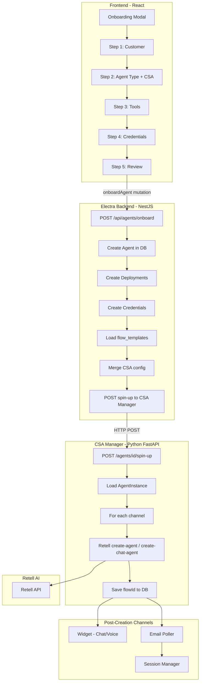
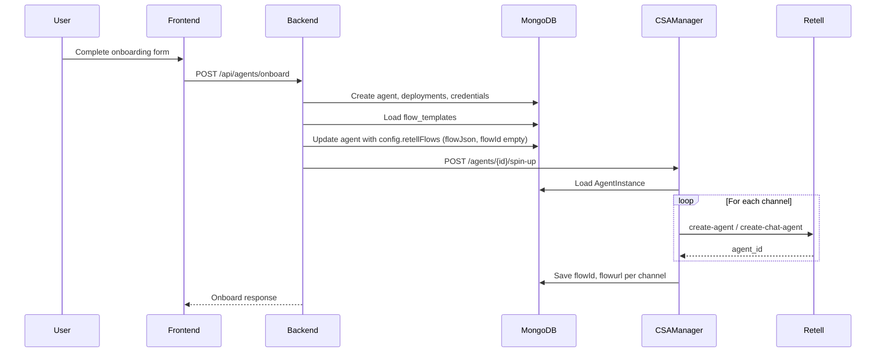

# Complete CSA + Retell Integration Workflow

This plan documents the full Electra flow from creating a CSA agent to Retell agent creation and channel operation. Use it as a reference to recreate or adapt the flow for your own business.

---

## Architecture Overview



---

## Phase 1: Frontend Onboarding Flow

### Steps and Components

| Step | File | Purpose |
| ---- | ---- | ------- |
| 1 | OnboardingModal.tsx, Step1Intake | Customer selection (existing business vs new), optional intake request link |
| 2 | Step2AgentTypeSelection.tsx | Product vs Custom; for CSA: **capability** (L1/L2/L3), **channels** (chat, email, voice) |
| 3 | Step3Configure.tsx | Select tools (Gmail, HubSpot, Zendesk, etc.), package tier |
| 4 | Step4CredentialsModal.tsx | OAuth credentials per tool per environment (sandbox/production) |
| 5 | Step5ReviewDeploy.tsx | Review and submit |

### CSA-Specific Fields Collected

- **csaCapabilityLevel**: `L1` | `L2` | `L3`
- **csaChannels**: `['chat']` | `['chat','email']` | `['chat','voice']` | etc.
- **productSku**: `'csa'`
- **toolIds**: Integration IDs (Gmail, CRM, ticketing, calendar)
- **credentials**: Per-tool credential data (OAuth tokens for Gmail, etc.)

### API Call

- **Endpoint**: `POST /api/agents/onboard`
- **Hook**: `useOnboardAgentMutation` in onboarding-api.ts
- **Request shape**: OnboardAgentDto — includes `businessId` or `businessDetails`, `agentName`, `agentType`, `toolIds`, `credentials`, `configuration`, `productSku`, `csaCapabilityLevel`, `csaChannels`, `intakeRequestId` (optional)

---

## Phase 2: Backend Onboard Agent

### Controller

- **File**: agents.controller.ts
- **Route**: `POST /api/agents/onboard`

### Service Flow (agents.service.ts)

**Phase 2a — Resolve User & Business (outside transaction)**

1. If `intakeRequestId`: prefill from intake (businessId, toolIds)
2. If `businessId`: validate business exists
3. If `businessDetails`: create or find user by email, create business if needed

**Phase 2b — Transaction: Create Agent + Dependencies**

1. Create **agent** document in `agent_instance` collection
2. Create **deployments** (sandbox, production) in `deployments` collection
3. Create **credentials** per tool per environment in `credentials` collection
4. If `intakeRequestId`: mark intake as onboarded

**Phase 2c — CSA Config (after commit, if productSku === 'csa')**

1. Load **flow template** from MongoDB `flow_templates` collection (`findOne({})` → `flowDoc.flow`)
2. Build **integrations** from tools: `buildIntegrationsFromTools()` maps tool slugs to `{ email, crm, ticketing, calendar }`
3. Build **config.retellFlows** for each channel in `csaChannels`:
   - `chat`, `email`, `voice` each get `{ flowId: '', flowJson: sharedFlowJson, flowurl: '' }`
4. Set `config.capabilityLevel`, `config.skills`, optional `config.scheduling` (if calendar tool)
5. Update `agent_instance` with `config`

**Phase 2d — Trigger Spin-Up**

1. `POST {CSA_MANAGER_URL}/agents/{agentId}/spin-up` (e.g. `http://localhost:8000/agents/xxx/spin-up`)
2. Onboarding does **not** fail if spin-up fails (can retry manually)

### Key Data Structures

- **agent_instance** (MongoDB): `businessId`, `name`, `type`, `status`, `productSku`, `config`
- **config**: `integrations`, `retellFlows`, `capabilityLevel`, `skills`, `scheduling`

---

## Phase 3: CSA Manager Spin-Up

### Route

- **File**: agents.py (csa-manager/app/routes/)
- **Route**: `POST /agents/{agent_id}/spin-up`
- **Behavior**: Runs spin-up in background, returns `{"message": "Spin-up started"}` immediately

### Spin-Up Service (agent_spin_up.py)

1. Load `AgentInstance` from MongoDB by `agent_id`
2. For each channel in `('email', 'chat', 'voice')`:
   - Skip if `flow_json` is empty
   - Parse `flow_json` (JSON)
   - Replace CSA Manager URLs in flow (dev/uat → current env) so tool URLs point correctly
   - Skip if no `response_engine` in flow
   - Set `agent_name` = `"{capability} {business} {agent_id} {channel}"`
   - Inject `agent_id` into `conversationFlow.default_dynamic_variables` (for Retell tools)
   - **Voice**: call `create_agent(payload)` → Retell `POST /create-agent`
   - **Email/Chat**: call `create_chat_agent(payload)` → Retell `POST /create-chat-agent`
3. Retell returns `agent_id` (flowId) per channel
4. Save `flow_id` and `flowurl` into `agent_instance.config.retellFlows.{channel}`
5. Persist `AgentInstance` to MongoDB

### Retell Client (client.py)

- **create_chat_agent**: Creates conversation flow in Retell (if inline), then `POST /create-chat-agent`
- **create_agent**: Same flow + `voice_id` → `POST /create-agent`
- Uses `RETELL_API_KEY`, `RETELL_VOICE_ID` from settings

### AgentInstance Schema (agent_instance.py)

- Collection: `agent_instance` (shared with Electra backend)
- `config.retellFlows`: `chat`, `email`, `voice` each have `flow_id`, `flow_json`, `flowurl`, `phone_number` (voice)

---

## Phase 4: Flow Templates

### Storage

- **Collection**: MongoDB `flow_templates`
- **Structure**: `{ flow: { ... }, flowName?: string }`
- **flow** contains: `response_engine`, `conversationFlow` (nodes, edges), `tools`, etc.

### Usage

- Backend loads via `flowTemplatesColl.findOne({})` and uses `flowDoc.flow` for all CSA channels
- Same flow JSON is used for chat, email, and voice (each gets its own Retell agent)

### Update Script

- update-flow-template-sales-tools.ts: Updates tool URLs in flow to point at CSA Manager (dev/uat)

---

## Phase 5: Widget Integration

### Widget Config

- **Schema**: widget-config.schema.ts
- **agentId** in widget config = **Retell flow ID** (not Electra agent ID)
- **configId**: Short ID like `cfg-5a64d606` used in embed script

### Embedding

```html
<script src="/widget.js" data-config-id="cfg-xxx" data-api-url="https://api.example.com"></script>
```

### Widget Loader (widget.js)

1. Reads `data-config-id`, `data-api-url`
2. Fetches `GET {apiUrl}/widget-config/{configId}` (public, no auth)
3. Gets `agentId` (Retell ID), `publicKey`, `agentType` (chat/voice)
4. **Chat**: Retell CDN widget or `retell-widget-direct.js`
5. **Voice**: `retell-widget-direct.js` with voice UI

### Widget Config Creation (Admin)

- Admin creates widget config via WidgetConfigModal
- For CSA agents: `GET /api/agents/{id}/csa-config` returns `retellFlows.chat.flowId` or `retellFlows.voice.flowId` to prefill

---

## Phase 6: Post-Creation Channel Flows

### Chat

- Widget fetches config → uses `agentId` (Retell flow ID) → Retell widget connects directly to Retell
- Backend widget-configs.service.ts can proxy `createChat`, `sendMessage` to Retell API when needed

### Voice

- Same widget flow; `agentType === 'voice'` uses custom voice UI
- Retell voice agent created via `create-agent` (different from chat)

### Email

- **Poller**: email_poller/service.py — loads CSA agents, polls Gmail per agent
- **Credentials**: Fetched via `get_credentials_for_agent` (credentials manager)
- **Session Manager**: session_manager.py
  - Uses `config.retell_flows.email.flow_id`
  - Creates Retell chat via `create_chat(agent_id=flow_id)`
  - Sends user message → `create_chat_completion` → sends reply via Gmail in same thread
- **Thread Manager**: Maps email thread to Retell chat (thread_id → flowId, retellAiChatId)

---

## Environment Variables

| Service | Variable | Purpose |
| ------- | -------- | ------- |
| Backend | `CSA_MANAGER_URL` | URL for spin-up (e.g. `http://localhost:8000`) |
| Backend | `RETELL_API_KEY` | Retell API key (widget, chat proxy) |
| CSA Manager | `RETELL_API_KEY` | Retell API key (create agents, chat) |
| CSA Manager | `RETELL_VOICE_ID` | Default voice for voice agents |
| CSA Manager | `MONGODB_URI`, `DB_NAME` | Same DB as backend (agent_instance) |
| CSA Manager | `CSA_MANAGER_DEV_URL`, `CSA_MANAGER_UAT_URL` | For URL replacement in flow_json |

---

## Data Flow Summary



---

## Key Files Reference

| Area | Files |
| ---- | ----- |
| Frontend onboarding | OnboardingModal.tsx, Step2AgentTypeSelection.tsx, onboarding-api.ts |
| Backend onboard | agents.controller.ts, agents.service.ts, onboard-agent.dto.ts |
| CSA Manager spin-up | agents.py, spin_up.py, agent_spin_up.py, retell_ai/client.py |
| Agent schema | agent_instance.py (CSA Manager), agent.schema.ts (backend) |
| Flow templates | MongoDB flow_templates, update-flow-template-sales-tools.ts |
| Widget | widget.js, retell-widget-direct.js, widget-configs.service.ts |
| Email | email_poller/service.py, session_manager.py, thread_manager.py |

---

## Recreating for Your Business

1. **Minimal path (chat only)**: Backend creates agent → loads flow template → calls Retell `create-chat-agent` directly (no CSA Manager) → store flowId → embed widget with configId.
2. **Full path**: Implement or reuse CSA Manager, flow_templates, credentials manager, email poller.
3. **Customize**: Change capability levels, channels, tools, flow template structure, or widget UI to match your use case.
