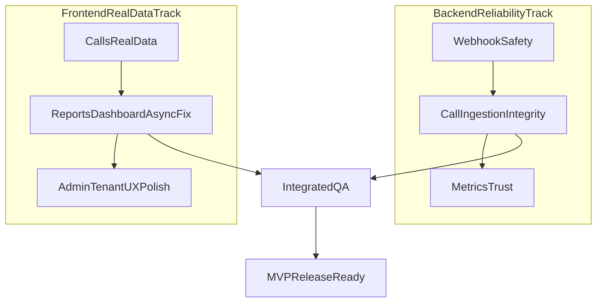

# Retell Full Plan (Admin + Tenant)

## Goal

Ship a 2-week MVP where both admin and tenant can operate on real Retell-driven data (calls, transcripts, outcomes, deployments) with reliable webhook ingestion and clear UX, while deferring non-critical deep analytics and ops extras.

## Current State Snapshot

- **Already working**
  - Agent create/deploy/deployments and onboarding flows are largely wired in frontend and backend.
  - Call-session persistence, admin/tenant calls APIs, booking linkage, and base dashboard/report call metrics now exist.
- **High-value gaps still open**
  - Webhook reliability/security hardening (dedupe semantics, signature robustness, replay safety).
  - Frontend calls/report/dashboard still has mock/partial wiring and async contract mismatches.
  - Agent detail and transcript-heavy experiences are incomplete in API mode.

## What To Add (with value)

- **Webhook processing hardening**
  - Value: prevents silent call-loss and bad analytics.
- **Real calls/transcript UI wiring**
  - Value: tenant/admin trust what they see; no "empty because mock" confusion.
- **Async-safe reports/dashboard hooks**
  - Value: stable pages in API mode, no Promise-as-data issues.
- **Agent detail API completion**
  - Value: support/debug teams can inspect actual live agents.
- **Tenant-role data consistency guardrails**
  - Value: avoids tenant access failures during demos/production.

## Parallel MVP Workstreams (2 weeks)

## Phase 1 (Days 1-4) — Reliability + Calls UI Core

- **Backend hardening**
  - Refactor Retell webhook processing in [apps/backend/src/webhooks/retell.webhook.controller.ts](apps/backend/src/webhooks/retell.webhook.controller.ts) and [apps/backend/src/webhooks/webhooks.service.ts](apps/backend/src/webhooks/webhooks.service.ts):
    - make dedupe safe against processing failures
    - strengthen signature/replay handling
    - ensure multi-channel agent resolution paths are covered
- **Frontend calls real-data**
  - Implement true API adapter in [apps/prototype/src/adapters/api/calls.adapter.ts](apps/prototype/src/adapters/api/calls.adapter.ts)
  - Update hooks to async patterns in [apps/prototype/src/modules/calls/hooks/useCallsList.ts](apps/prototype/src/modules/calls/hooks/useCallsList.ts) and [apps/prototype/src/modules/calls/hooks/useCallDetail.ts](apps/prototype/src/modules/calls/hooks/useCallDetail.ts)

## Phase 2 (Days 5-8) — Reports/Dashboard Real Data + Agent Drilldown

- **Fix async contract mismatches (critical UI stability)**
  - [apps/prototype/src/modules/reports/hooks/useReports.ts](apps/prototype/src/modules/reports/hooks/useReports.ts)
  - [apps/prototype/src/modules/admin/hooks/useTenantComparison.ts](apps/prototype/src/modules/admin/hooks/useTenantComparison.ts)
- **Fill missing adapter coverage**
  - Reports: [apps/prototype/src/adapters/api/reports.adapter.ts](apps/prototype/src/adapters/api/reports.adapter.ts)
  - Dashboard: [apps/prototype/src/adapters/api/dashboard.adapter.ts](apps/prototype/src/adapters/api/dashboard.adapter.ts)
  - Admin overview gaps: [apps/prototype/src/adapters/api/admin.adapter.ts](apps/prototype/src/adapters/api/admin.adapter.ts)
  - Agent detail endpoints/mapping: [apps/prototype/src/adapters/api/agents.adapter.ts](apps/prototype/src/adapters/api/agents.adapter.ts)

## Phase 3 (Days 9-12) — Tenant/Admin UX Completion + Guardrails

- **Tenant/admin UX reliability pass**
  - consistent loading/error/empty states for calls/transcripts/reports/deployments
  - remove misleading placeholder values where real data is expected
- **Access consistency**
  - confirm tenant role/claim consistency paths in [apps/backend/src/auth/auth.service.ts](apps/backend/src/auth/auth.service.ts) and [apps/backend/src/common/guards/tenant.guard.ts](apps/backend/src/common/guards/tenant.guard.ts)

## Phase 4 (Days 13-14) — E2E Validation + Launch Readiness

- **Scenario QA (must pass)**
  - agent created and deployed
  - call webhooks ingested
  - transcript/outcome visible in admin + tenant calls
  - booking linked to call outcome
  - dashboard/reports reflect same call counts
- **Regression checks**
  - tenant isolation
  - webhook duplicate/retry behavior
  - API-mode frontend pages with no mock fallback masking

## Not In MVP (defer after 2-week release)

- Full reconciliation worker/backfill from provider history
- Durable metrics stack + alerting pipeline
- Comprehensive call/transcript export suite
- Advanced RBAC policy matrix beyond current role guards

## Acceptance Criteria (MVP)

- Admin and tenant calls pages use real API data (no mock cache path).
- Retell call events become persisted call sessions with transcript/summary/sentiment/outcome.
- Booking flow updates call outcome linkage when call correlation exists.
- Dashboard/report call metrics match call-session records within expected aggregation windows.
- Core admin + tenant Retell workflows are demo-safe and production-usable for MVP scope.
