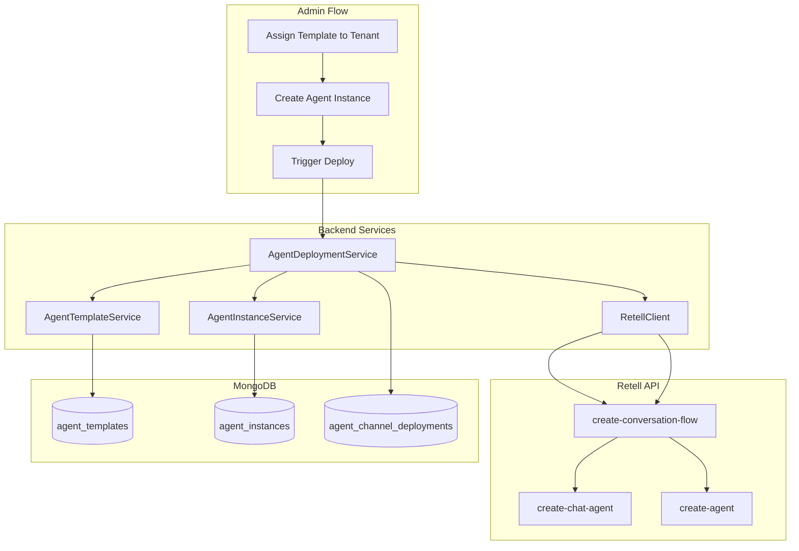

# Retell Agent Deployment Engine — Production Development Roadmap

## Current State

- **Backend**: NestJS, MongoDB, Mongoose
- **Existing modules**: `agent-templates`, `agent-instances`, `tenants`, `webhooks` (Retell webhook at `/webhooks/retell`)
- **Schema gap**: Current `agent_templates` lacks `flowTemplate`, `supportedChannels`, `capabilityLevel`. Current `agent_instances` is one-per-channel; target is one-per-tenant with `channelsEnabled[]`. No `agent_channel_deployments` collection.
- **Template source**: FLOWTEMPLATES.json — array of `{ _id, flow, flowName }`; `flow` contains `conversationFlow`, `tools`, `default_dynamic_variables`. Tool URLs must be replaced with `{{API_BASE_URL}}` at import and resolved at deploy time.

---

## Architecture Overview



---

## Phase 0: Prerequisites and Environment

**Goal**: Ensure environment and config are ready.

**Tasks**:

- Add to `apps/backend/.env.example`:
  - `RETELL_VOICE_ID` (required for voice agents)
  - `API_BASE_URL` (e.g. `http://localhost:3001` for dev)
  - `RETELL_WEBHOOK_SECRET` (optional, for webhook verification)
  - `RETELL_TOOL_API_KEY` (for authenticating Retell tool calls to our backend)
  - `REDIS_URL` (required for BullMQ job queue; existing in project)
- Document env vars in `.env.example` comments.

**0.1 Environment configuration**

- `API_BASE_URL` must differ per environment (dev/staging/prod)
- `RETELL_VOICE_ID`: use template `voice_id` if present, else fall back to env
- Retell base URL: `https://api.retellai.com` (or sandbox if applicable)

**Output**: Updated `.env.example`; no code changes.

---

## Phase 1: Schema and Data Model

**Goal**: Add new schemas and extend existing ones without breaking current behavior.

**1.1 Extend `agent_templates`** (`apps/backend/src/agent-templates/schemas/agent-template.schema.ts`)

Add fields (keep existing for backward compatibility):

- `slug: string` (unique, optional)
- `supportedChannels: string[]` (e.g. `['chat', 'voice']`)
- `capabilityLevel: string` (e.g. `'L1' | 'L2' | 'L3'`)
- `flowTemplate: Record<string, unknown>` (Retell flow JSON)
- `category: string` (optional)

Add index: `{ slug: 1 }` unique sparse.

**1.2 Create `agent_channel_deployments` schema**

New file: `apps/backend/src/agent-deployments/schemas/agent-channel-deployment.schema.ts`

```typescript
// Fields: tenantId, agentInstanceId, channel, provider, status, retellAgentId, retellConversationFlowId, flowSnapshot, error?, createdBy?, deletedAt?, createdAt, updatedAt
```

- Add `deletedAt` for soft delete (per backend rules)
- Add `createdBy` (ObjectId ref User) for audit trail

Indexes: `{ tenantId: 1 }`, `{ agentInstanceId: 1 }`, `{ retellAgentId: 1 }` sparse, `{ deletedAt: 1 }` sparse.

**1.3 Refactor `agent_instances`** (`apps/backend/src/agent-instances/schemas/agent-instance.schema.ts`)

Add fields (keep `channel` for backward compatibility during migration):

- `channelsEnabled: string[]` (e.g. `['chat', 'voice']`)
- `templateVersion: number`
- `customConfig: Record<string, unknown>`
- `assignedToStaffIds: Types.ObjectId[]` (optional)
- `name: string` (instance display name)

Retell IDs move to `agent_channel_deployments`; keep `retellAgentId` on instance only if a single-channel shortcut is needed (e.g. for first/primary channel).

**1.4 Create `agent-deployments` module**

- `AgentDeploymentsModule`
- `AgentChannelDeployment` schema
- `AgentDeploymentsService` (CRUD for deployments)

**Output**: New schema, extended schemas, new module; no breaking API changes yet.

---

## Phase 2: Retell Client

**Goal**: Dedicated HTTP client for Retell API.

**2.1 Create Retell module**

New directory: `apps/backend/src/retell/`

**2.2 RetellClient** (`retell/retell.client.ts`)

- Inject `ConfigService` for `RETELL_API_KEY`, `RETELL_VOICE_ID`
- Base URL: `https://api.retellai.com`
- Headers: `Authorization: Bearer {RETELL_API_KEY}`, `Content-Type: application/json`

Methods:

- `createConversationFlow(flow: object): Promise<{ conversation_flow_id: string }>`
- `createChatAgent(payload: { response_engine, agent_name?, ... }): Promise<{ agent_id: string }>`
- `createAgent(payload: { response_engine, voice_id, agent_name?, ... }): Promise<{ agent_id: string }>`

Error handling: wrap Retell errors, throw `RetellApiException` with status and message.

**2.2.1 Retell API resilience**

- Retry with exponential backoff for 429 (rate limit) and 5xx (transient)
- Configurable timeout (e.g. 30s per request)
- Log Retell responses and errors (server-side only)

**2.3 RetellModule**

- Register `RetellClient` as provider
- Export for use in `AgentDeploymentsModule`

**Output**: `RetellClient` usable by deployment service.

---

## Phase 3: Template Processing and Flow Builder

**Goal**: Load template, inject variables, replace URLs.

**3.1 Flow processor utility** (`agent-deployments/utils/flow-processor.ts`)

- `processFlowTemplate(flow: object, ctx: { tenantId, agentInstanceId, apiBaseUrl }): object`
- Replace `{{tenantId}}`, `{{agentInstanceId}}`, `{{API_BASE_URL}}` in:
  - `conversationFlow.default_dynamic_variables`
  - Tool `url` fields (replace placeholder with `{apiBaseUrl}/...`)
- Inject `agent_id` and `agent_instance_id` into `default_dynamic_variables`
- Return deep-cloned, processed flow

**3.2 Flow validation**

- Validate presence of `conversationFlow`, `response_engine`, `tools`
- Validate `nodes` structure if needed
- Enforce `flowTemplate` size limit (e.g. 4MB) to avoid MongoDB 16MB document issues

**Output**: Reusable flow processor for deployment.

---

## Phase 4: Agent Deployment Service

**Goal**: Core spin-up logic.

**4.1 AgentDeploymentService** (`agent-deployments/agent-deployment.service.ts`)

Dependencies: `AgentTemplateService`, `AgentsService`, `AgentDeploymentsService`, `RetellClient`, `ConfigService`

Method: `deployAgentInstance(agentInstanceId: string): Promise<DeployResult>`

Logic:

1. Load `AgentInstance` by ID; verify `tenantId`
2. Load `AgentTemplate` by `templateId`
3. If no `flowTemplate`, throw
4. For each channel in `channelsEnabled` (e.g. `chat`, `voice`):
   - Process flow via flow processor
   - Create conversation flow via `RetellClient.createConversationFlow`
   - If `channel === 'voice'`: `createAgent` with `voice_id`
   - Else: `createChatAgent`
   - Create/update `AgentChannelDeployment` with `retellAgentId`, `retellConversationFlowId`, `flowSnapshot`, `status: 'active'`
5. On Retell error: save deployment with `status: 'failed'`, `error` message
6. Update `AgentInstance.status` to `active` or `failed` as appropriate

**4.2 Idempotency**

- If deployment for channel already exists and `status === 'active'`, optionally skip or redeploy based on config
- Store `flowSnapshot` for debugging

**4.3 Concurrency guard**

- Deployment lock per `agentInstanceId` (Redis lock or DB flag `deploying: true`)
- Reject overlapping deploy requests; return 409 if deploy already in progress

**4.4 Partial deployment**

- If one channel succeeds and another fails: mark instance `status: 'partially_deployed'` or keep per-channel status
- Store failed channel in deployment with `status: 'failed'`, `error` message
- Retry endpoint supports redeploy of failed channels only

**Output**: `AgentDeploymentService.deployAgentInstance()` ready to be called by API.

---

## Phase 5: Agent Instance APIs and Tenant Integration

**Goal**: Create agent instances from templates and wire to tenant creation.

**5.1 Create agent instance API**

- `POST /api/admin/tenants/:tenantId/agents` — create agent instance from template
- Body: `{ templateId, name?, channelsEnabled: ['chat','voice'] }`
- Guard: `JwtAuthGuard`, `AdminGuard`
- Service: create `AgentInstance` with `status: 'deploying'`
- Optionally trigger deployment (Phase 6)

**5.2 Tenant creation integration**

- Extend `CreateTenantDto`: optional `templateId`, `channelsEnabled`
- In `TenantsService.create`: after creating tenant, if `templateId` provided, create `AgentInstance` and trigger deployment (async)

**5.3 List agents by tenant**

- `GET /api/admin/tenants/:tenantId/agents` — list agent instances for tenant
- `GET /api/tenant/agents` — tenant-scoped list (existing route; ensure it returns new shape)

**Output**: Admin can create tenants with agent assignment; tenant-scoped agent list works.

---

## Phase 6: Deployment APIs and Triggers

**Goal**: Manual deploy endpoint and automatic trigger on create.

**6.1 Deploy endpoint**

- `POST /api/admin/agents/:agentId/deploy`
- Guard: `JwtAuthGuard`, `AdminGuard`
- Verify agent belongs to a tenant admin can access
- Call `AgentDeploymentService.deployAgentInstance(agentId)`
- Return `{ message, deployments: [...] }`

**6.2 Automatic trigger**

- Use job queue (BullMQ + Redis) for deployment jobs — not `setImmediate`
- When creating agent instance: enqueue `deploy-agent` job with `agentInstanceId`
- Job processor: call `AgentDeploymentService.deployAgentInstance`
- Retries: 3 attempts with exponential backoff on failure
- Do not block HTTP response; onboarding succeeds even if deploy fails
- Log failures for manual retry; expose job status via API if needed

**6.3 Get deployments**

- `GET /api/admin/agents/:agentId/deployments` — list `AgentChannelDeployment` for instance
- `GET /api/tenant/agents/:agentId/deployments` — tenant-scoped

**Output**: Manual and automatic deployment; deployment status visible via API.

---

## Phase 7: Template Import and Seed

**Goal**: Load FLOWTEMPLATES.json into `agent_templates`.

**7.1 Seed script or import API**

- Option A: Add to `apps/backend/src/db/seed.ts` — import first item from FLOWTEMPLATES.json into `agent_templates` with `flowTemplate = flow`, `supportedChannels = ['chat','voice']`, `capabilityLevel = 'L3'`
- Option B: `POST /api/admin/templates/import` — accept JSON body, validate, upsert
- Replace tool URLs in `flowTemplate` with `{{API_BASE_URL}}` placeholders during import so runtime replacement works

**7.2 Tool URL replacement strategy**

- Import: replace any external tool base URLs with `{{API_BASE_URL}}` placeholder
- At deploy time: replace `{{API_BASE_URL}}` with `ConfigService.get('API_BASE_URL')`

**Output**: At least one template in DB; deployable flow with correct URLs.

---

## Phase 8: Error Handling and Observability

**Goal**: Production-ready error handling and logging.

**8.1 Centralized Retell errors**

- `RetellApiException` filter — map to HTTP 502/503 with safe message
- Log full error server-side

**8.2 Deployment status**

- `AgentChannelDeployment.status`: `pending`, `active`, `failed`
- `AgentChannelDeployment.error`: string when failed
- Expose in GET deployments response

**8.3 Audit**

- Log deployment events via existing `AuditService`: `agent.deployed`, `agent.deploy_failed`

**Output**: Clear errors, audit trail, deployment status.

---

## Phase 9: Tool Endpoints, Auth, and Lifecycle

**Goal**: Production-ready tool handling and resource cleanup.

**9.1 Tool backend endpoints**

- Implement endpoints under `POST /api/agents/tools/*` that Retell will call (e.g. `get_agent_config`, `create_ticket`, `get_available_slots`, `book_meeting` — adapt to clinic CRM domain)
- Each tool must validate `agent_id` and enforce tenant isolation
- Return proper error codes; never expose internal errors to Retell

**9.2 Tool authentication**

- Define auth strategy: shared `RETELL_TOOL_API_KEY` or per-agent token
- Validate `agent_id` from request against DB; ensure agent belongs to tenant
- Reject requests with invalid or missing auth

**9.3 Retell resource lifecycle**

- On tenant or agent instance deletion: call Retell delete API to remove agents and conversation flows
- Implement `deleteAgent`, `deleteConversationFlow` in RetellClient (if Retell supports)
- Avoid orphaned Retell resources and billing leakage

**Output**: Tools work end-to-end; secure; no orphaned Retell resources.

---

## Phase 10: Testing and Observability

**Goal**: Production-grade quality and visibility.

**10.1 Testing**

- Unit tests: `AgentDeploymentService`, flow processor, RetellClient (mocked)
- Integration tests: deploy flow with mocked Retell API
- Flow processor edge cases: nested placeholders, malformed JSON

**10.2 Observability**

- Structured logging with correlation IDs
- Metrics: deployment success/failure count, latency
- Health check: `GET /health` includes Retell API connectivity probe
- Alert on deployment failure rate threshold

**10.3 API versioning and rate limiting**

- Use versioned routes: `/api/v1/admin/agents/:id/deploy`
- Rate limit deploy endpoint (e.g. 10/min per tenant or per admin)

**Output**: Testable, observable, rate-limited deployment system.

---

## Implementation Order

| Phase | Depends On | Est. Scope |
| ----- | ---------- | ---------- |
| 0     | —          | 1 file     |
| 1     | 0          | 4–5 files  |
| 2     | 0          | 3–4 files  |
| 3     | 1          | 1–2 files  |
| 4     | 1, 2, 3    | 2–3 files  |
| 5     | 1, 4       | 4–5 files  |
| 6     | 4, 5       | 4–5 files (incl. BullMQ) |
| 7     | 1, 3       | 1–2 files  |
| 8     | 4, 6       | 2–3 files  |
| 9     | 4, 6       | 5–8 files  |
| 10    | 4, 6       | 3–5 files  |

---

## Migration Notes

- **Existing `agent_instances`**: Current model is one-per-channel. Options:
  - (A) New instances use new schema; old data remains until deprecated
  - (B) Migration script to consolidate by tenant and create `agent_channel_deployments` from existing `retellAgentId`
- **Existing `agent_templates`**: Add new fields; existing records can have `flowTemplate: null` until imported.
- **Migration script**: Include rollback plan; run in transaction or with feature flag for gradual rollout.

---

## Security Checklist

- All agent/tenant APIs enforce `tenantId` in query
- Admin routes use `AdminGuard`
- Tenant routes use `TenantGuard` and scope to `req.tenantId`
- No secrets in logs or responses
- `API_BASE_URL` from env only

---

## Files to Create or Modify (Summary)

**New**:

- `agent-deployments/` module (schema, service, controller, flow processor, deployment processor)
- `retell/` module (client, module)
- `agents/tools/` controller and handlers for Retell tool callbacks
- BullMQ deployment job processor

**Modify**:

- `agent-templates/schemas/agent-template.schema.ts`
- `agent-instances/schemas/agent-instance.schema.ts`
- `tenants/tenants.service.ts`, `create-tenant.dto.ts`
- `agent-instances/agents.controller.ts`, `agents.service.ts`
- `app.module.ts`
- `.env.example`
